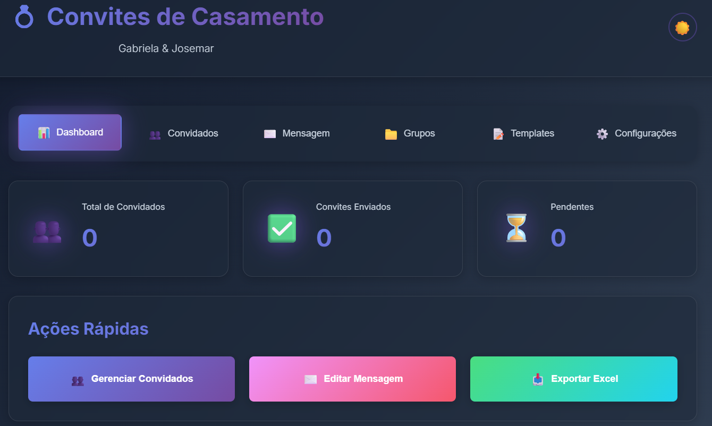

# Sistema de Convites de Casamento - Dockerizado 🐳

Sistema completo containerizado com Docker Compose para envio de convites de casamento via WhatsApp.



## 📦 Pré-requisitos

- Docker
- Docker Compose
- EvolutionAPI

## 🚀 Início Rápido

Crie a rede docker e suba o sistema

```bash
# 1. Subir todo o sistema
docker network create wedding_shared_net
make docker-up

# 2. Acessar aplicação
# Frontend: http://localhost:3000/login.html
# Swagger: http://localhost:5000/docs
# Backend:  http://localhost:5000/api
```

### 🔑 Credenciais Padrão
```
Usuário: admin
Senha: admin123
```

## 📚 Documentação

| Documento | Descrição |
|-----------|-----------|
| **[QUICK_START.md](QUICK_START.md)** | ⭐ Comece aqui! |
| **[SWAGGER_DOCS.md](SWAGGER_DOCS.md)** | 📖 Documentação API Swagger |
| **[AUTH_SETUP.md](AUTH_SETUP.md)** | 🔐 Sistema de autenticação |
| **[LOGIN_GUIDE.md](LOGIN_GUIDE.md)** | 🔑 Guia de login |
| **[IMPLEMENTATION_SUMMARY.md](IMPLEMENTATION_SUMMARY.md)** | 📝 Detalhes técnicos |

## 📦 O que está incluído?

- ✅ **Backend Flask** (API REST completa com autenticação JWT)
- ✅ **Frontend Nginx** (Interface web moderna com login)
- ✅ **EvolutionAPI** (Integração WhatsApp)
- ✅ **Volumes persistentes** (Dados salvos)
- ✅ **Network isolada** (Comunicação segura)
- ✅ **Swagger/OpenAPI** (Documentação automática da API)

## 🎯 Arquitetura

```
┌──────────────────────────────────┐
│      Docker Compose Stack        │
│                                  │
│  Frontend (Nginx) :3000          │
│  Login + Dashboard               │
│         ↓                        │
│  Backend (Flask) :5000           │
│  API REST + Swagger Docs         │
│         ↓                        │
│  EvolutionAPI :8080              │
│  WhatsApp Integration            │
└──────────────────────────────────┘
```

## 📝 Comandos Disponíveis

### Docker Compose (Recomendado)

```bash
make docker-up        # Subir sistema completo
make docker-down      # Parar sistema
make docker-logs      # Ver logs
make docker-restart   # Reiniciar
make docker-build     # Rebuild imagens
make docker-status    # Ver status
make docker-clean     # Limpar tudo (CUIDADO!)
```

### Backend Local (Desenvolvimento)

```bash
make backend-setup     # Instalar dependências
make backend-init-db   # Inicializar banco
make backend-run       # Rodar Flask local
```

### EvolutionAPI Standalone

```bash
make up       # Subir apenas EvolutionAPI
make down     # Parar
make logs     # Ver logs
make reset    # Reset completo
```

## 🔧 Configuração

### Variáveis de Ambiente

Edite `docker-compose.yml` ou crie `.env`:

```env
EVOLUTION_API_KEY=sua-chave-aqui
FLASK_SECRET_KEY=sua-secret-key
```

### Portas

- **3000**: Frontend (Nginx)
- **5000**: Backend (Flask API)
- **8080**: EvolutionAPI Manager

Para alterar, edite `docker-compose.yml`:

```yaml
ports:
  - "8000:80" # Exemplo: frontend na porta 8000
```

## 📂 Volumes Persistentes

Dados salvos automaticamente:

- `evolution_data`: Sessões WhatsApp
- `backend_uploads`: Imagens de convites
- `backend_db`: Banco de dados SQLite

### Backup

```bash
# Listar volumes
docker volume ls

# Backup do banco
docker cp wedding-backend:/app/data/wedding_invites.db ./backup.db

# Restore
docker cp ./backup.db wedding-backend:/app/data/wedding_invites.db
```

## 🛠️ Desenvolvimento

### Hot Reload

Para desenvolvimento com hot reload:

```bash
# Backend: edite arquivos em api/ e restart
make docker-restart

# Frontend: edite web/ e rebuild
docker-compose up -d --build frontend
```

### Logs em Tempo Real

```bash
# Todos os serviços
make docker-logs

# Serviço específico
docker-compose logs -f backend
```

### Acessar Shell

```bash
# Backend
docker exec -it wedding-backend bash

# Frontend
docker exec -it wedding-frontend sh
```

## 🐛 Troubleshooting

### Containers não sobem

```bash
# Verificar configuração
docker-compose config

# Rebuild forçado
docker-compose build --no-cache
docker-compose up -d
```

### Porta já em uso

```bash
# Encontrar processo usando porta 3000
lsof -i :3000
kill -9 <PID>

# Ou mudar porta no docker-compose.yml
```

### Banco de dados com erro

```bash
# Reinicializar banco
make docker-clean
make docker-up
# ATENÇÃO: isso apaga todos os dados!
```

### Frontend não carrega

```bash
# Verificar logs do Nginx
docker logs wedding-frontend

# Testar backend diretamente
curl http://localhost:5000/api/stats
```

## 📊 Monitoramento

### Ver uso de recursos

```bash
# CPU e memória
docker stats

# Espaço em disco
docker system df
```

### Health Check

```bash
# Status dos containers
docker-compose ps

# Teste de conectividade
curl http://localhost:3000      # Frontend
curl http://localhost:5000/api  # Backend
curl http://localhost:8080      # EvolutionAPI
```

## 🔐 Segurança (Produção)

### 1. Alterar Secrets

```bash
# Gerar chaves fortes
openssl rand -hex 32

# Atualizar docker-compose.yml
FLASK_SECRET_KEY=<chave-gerada>
EVOLUTION_API_KEY=<chave-gerada>
```

### 2. HTTPS com SSL

Use Traefik ou Nginx Proxy Manager:

```yaml
services:
  traefik:
    image: traefik:latest
    ports:
      - "443:443"
    # ... configuração SSL
```

### 3. Firewall

```bash
# Permitir apenas HTTPS
sudo ufw allow 443
sudo ufw deny 3000
sudo ufw deny 5000
sudo ufw deny 8080
```

## 🚢 Deploy em Produção

### Docker Swarm

```bash
docker swarm init
docker stack deploy -c docker-compose.yml wedding
```

### Kubernetes

```bash
kubectl apply -f k8s/
```

### Cloud (AWS/GCP/Azure)

Use Docker Compose ou Kubernetes managed services.

## 📚 Documentação Adicional

- [Backend API](api/README.md)
- [Frontend](web/README.md)
- [Docker Details](DOCKER.md)

## 🎉 Pronto para Usar!

```bash
make docker-up
```

Acesse: **http://localhost:3000** 🚀

## 📞 Suporte

Problemas? Verifique:

1. Docker está rodando: `docker ps`
2. Compose config: `docker-compose config`
3. Logs: `make docker-logs`

---

Desenvolvido com ❤️ para Gabriela & Josemar 💍
